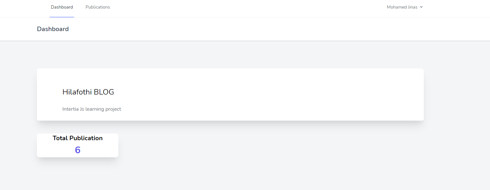
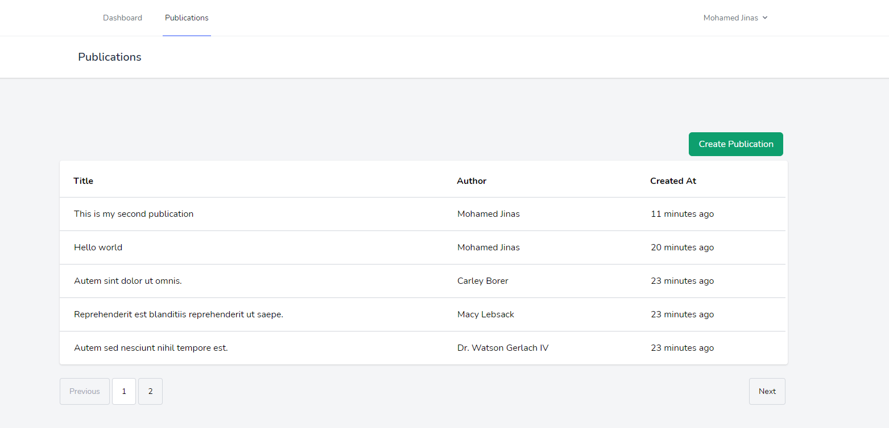
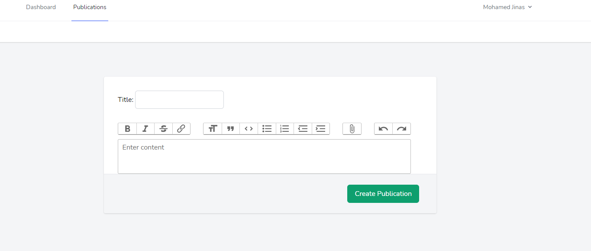
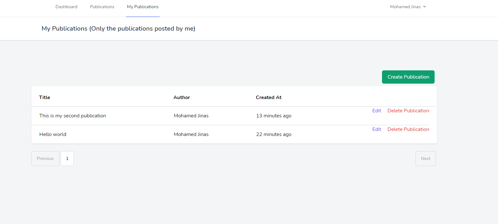

## Inertia JS Learning project

This is a sample blog I made to familiarize myself with using intertia JS with Laravel


## Some screenshots










## Installation

Clone the repo

```
composer install
```

```
npm install
```

```
npm run dev
```

```
php artisan serve
```